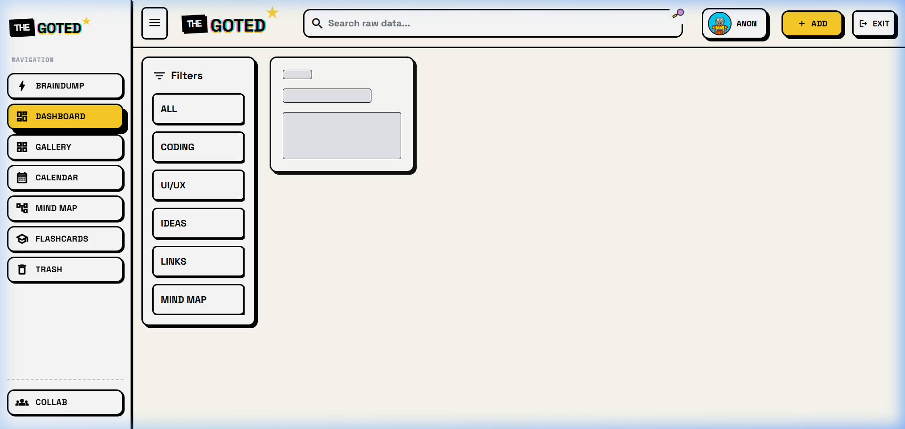
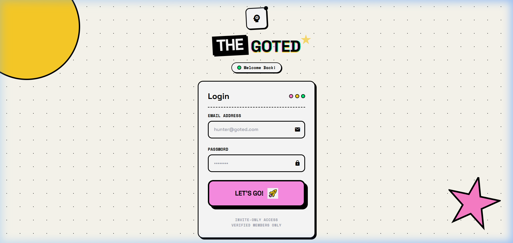
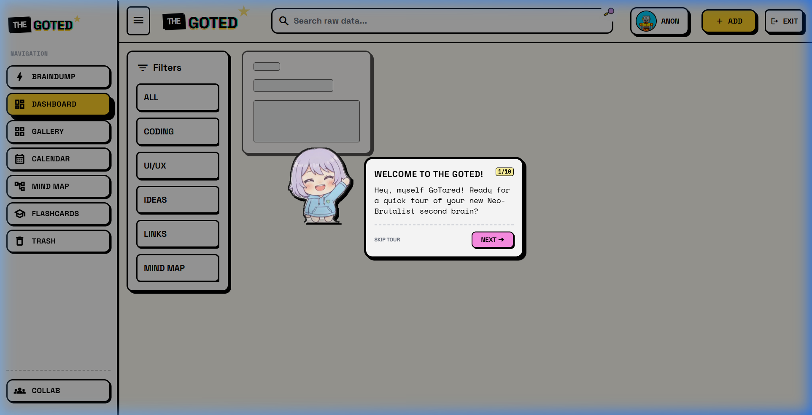

<p align="center">
  
</p>

<h1 align="center">THE GOTED</h1>

<p align="center">
  <strong>⚡ A Neo-Brutalist Second Brain for the Unapologetic Thinker ⚡</strong>
</p>

<p align="center">
  
  
  
  
  
</p>

<br />

<p align="center">
  
</p>

---

## 🧠 What is The Goted?

One place. One vault. Everything captured.

**The Goted** is a personal knowledge management system built with raw, unapologetic **Neo-Brutalism** design. Capture notes, ideas, code snippets, links, and files — all searchable, all organized, all yours.

No frameworks. No bloat. Just **HTML + Vanilla JS + Supabase** with thick borders, hard shadows, and bold typography.

---

## ✨ Features

<table>
<tr>
<td width="50%">

### 📝 Brain Dump
Quickly capture ideas without overthinking. Type, crystallize, done.

### 🗃️ Vault Gallery
Filter and search all your captured notes, links, code, and ideas in one organized view.

### 🧩 Mind Maps
Connect ideas spatially with an interactive drag-and-drop mind map builder.

### 🃏 Flashcards
Turn vault entries into study flashcards for memorization and review.

</td>
<td width="50%">

### 🤝 Collab Mode
Connect with friends, share mind maps, send peek requests, and collaborate in real-time.

### 💬 Built-in Chat
Real-time messaging between connected collaborators powered by Supabase Realtime.

### 🗑️ Trash & Archive
Soft-delete items with full restore capability. Incinerate when you're sure.

### 🎓 GoTared Tutorial Guide
An adorable mascot guides new users through every feature with a step-by-step tour.

</td>
</tr>
</table>

---

## 🎨 Design System

The Goted follows a strict **Neo-Brutalist** design language:

| Element | Rule |
|---|---|
| **Borders** | 3-4px solid black on everything |
| **Shadows** | Hard shadows: `4px 4px 0px #000` — no blur, ever |
| **Hover** | Element shifts: `translate(-2px, -2px)` |
| **Active** | Element presses: `translate(2px, 2px)` |
| **Spacing** | 8px grid system |
| **Contrast** | High contrast always — readability is non-negotiable |

### 🎨 Color Palette

```
Primary Yellow  ─── #FFD028  ── Navigation, primary actions
Neo Pink        ─── #FF90E8  ── CTAs, highlights, buttons
Accent Mint     ─── #23F0C7  ── Success states, accents
Success Green   ─── #00E074  ── Confirmations, notes
Hot Pink        ─── #FF2D78  ── Ideas, danger, warnings
Code Orange     ─── #FF6B00  ── Code blocks
Link Blue       ─── #0066FF  ── Links, references
```

### 🔤 Typography

| Usage | Font | Weight |
|---|---|---|
| Display / Headers | Space Grotesk | 700-800 |
| UI Labels / Mono | Space Mono | 400 / 700 |
| Body | Space Grotesk | 400-500 |

---

## 🖼️ Screenshots

<details>
<summary><strong>🔐 Login Screen</strong> (click to expand)</summary>
<br />
<p align="center">
  
</p>
<p align="center"><em>Invite-only access with email + password authentication via Supabase</em></p>
</details>

<details>
<summary><strong>🎓 GoTared Tutorial</strong> (click to expand)</summary>
<br />
<p align="center">
  
</p>
<p align="center"><em>GoTared, the mascot, guides you through every feature on your first visit</em></p>
</details>

---

## 🚀 Quick Start

### Prerequisites

- A [Supabase](https://supabase.com) project (free tier works)
- Any HTTP server (Node.js, Python, etc.)

### 1. Clone the repo

```bash
git clone https://github.com/bunnybot1121/goted.git
cd goted
```

### 2. Setup Supabase

Run the SQL files in your Supabase SQL Editor in this order:

```
1. supabase_setup.sql          → Core items table + RLS policies
2. supabase_profiles.sql       → User profiles + avatars
3. supabase_chat_setup.sql     → Real-time chat tables
4. supabase_item_sharing.sql   → Item sharing between users
```

### 3. Configure

Open `app.js` and update lines 1-2 with your Supabase credentials:

```javascript
const SUPABASE_URL = 'https://your-project.supabase.co';
const SUPABASE_KEY = 'your-anon-key';
```

### 4. Create a User

In Supabase Dashboard → **Authentication** → **Users** → **Add User**:
- Enter email + password
- Check **"Auto Confirm User"**

### 5. Run

```bash
npx http-server . -p 8080 -c-1
# Open http://localhost:8080
```

---

## 📁 Project Structure

```
goted/
├── index.html                            # Main app (all views, modals, sidebars)
├── app.js                                # Core logic, Supabase integration, auth
├── mindmap.js                            # Interactive mind map engine
├── tutorial.js                           # GoTared mascot tutorial system
├── processor.py                          # GoTared sprite extractor from character sheet
├── clean_sprites.py                      # Sprite background remover + border adder
│
├── icons/                                # App icons
│   ├── brain.png                         # Logo
│   ├── rocket.png                        # Login button icon
│   └── ...
│
├── assets/
│   └── avatars/                          # GoTared mascot sprites (14 emotions)
│       ├── gotared_1.png → gotared_14.png
│       └── avatar_1.jpg → avatar_14.jpg  # User profile avatars
│
├── screenshots/                          # README screenshots
│
└── supabase_*.sql                        # Database setup scripts
```

---

## 🤖 Meet GoTared

<p align="center">
  
  
  
  
  
</p>

<p align="center">
  <strong>GoTared</strong> — your personal guide through The Goted.<br />
  She appears on your first visit to walk you through every feature with 14 different emotions.
</p>

---

## ⌨️ Keyboard Shortcuts

| Shortcut | Action |
|---|---|
| `Ctrl + K` | Focus search bar |
| `Ctrl + S` | Save current item |
| `Esc` | Close any open modal |

---

## 🛡️ Security

- **Invite-only**: Users are created manually in the Supabase dashboard
- **Row Level Security**: Every table has RLS policies — users can only access their own data
- **No API keys exposed**: Supabase anon key is read-only with RLS enforcement
- **Session-based auth**: Supabase handles JWT tokens automatically

---

## 🛠️ Tech Stack

| Layer | Technology |
|---|---|
| **Frontend** | HTML5, Vanilla JavaScript, Tailwind CSS |
| **Backend** | Supabase (PostgreSQL + Auth + Realtime + Storage) |
| **Design** | Neo-Brutalism via Tailwind custom config |
| **Hosting** | GitHub Pages / any static host |
| **Auth** | Supabase Auth (Email + Password) |

---

## 📜 License

This project is private and invite-only. All rights reserved.

---

<p align="center">
  
  <br />
  <strong>Built with brutal honesty.</strong><br />
  <em>No gradients hiding structure. No blur softening edges. Everything is what it is.</em>
</p>